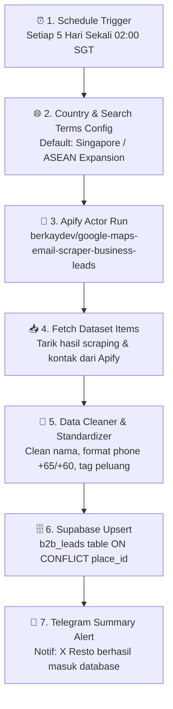

# 📋 PERENCANAAN WORKFLOW 1: Apify Lead Scraper & Database Ingestion Engine
**Brand:** Juragan by Anak Bawang  
**Target Utama:** Restoran & Bisnis Kuliner Indonesia di Kawasan ASEAN (Singapore ➔ Malaysia ➔ Brunei ➔ Thailand ➔ Global)  
**Siklus Eksekusi:** Rutin Otomatis per 5 Hari Sekali (`0 2 */5 * *`)  

---

## 🎯 1. Tujuan & Arsitektur Utama

Workflow 1 berfungsi sebagai **Hulu Data (Data Ingestion)**. Tugasnya adalah mencari, mengikis (*scraping*), memperkaya (*enriching* kontak email/WA/Instagram), dan menyuntikkan (*upsert*) data prospek restoran Indonesia ke database Supabase secara berkala tanpa campur tangan manual.



---

## ⚙️ 2. Konfigurasi Aktor Apify

* **Kredensial:** Apify API Key (`Akun Fahru3`)
* **Actor ID:** `berkaydev/google-maps-email-scraper-business-leads`
* **Resource Setting:**
  - Memory: `1024 MB (1 GB)`
  - Timeout: `300 detik`
  - Max Cost per Run: `USD 0.20 - 0.50`

### 📦 Payload Input JSON Dinamis:

```json
{
  "enrichLeads": true,
  "extractEmail": true,
  "location": "={{ $json.target_location }}",
  "maxResults": 50,
  "onlyWithPhone": true,
  "onlyWithWebsite": true,
  "proxyConfiguration": {
    "useApifyProxy": true,
    "apifyProxyGroups": []
  },
  "searchTerms": [
    "Indonesian restaurant",
    "Indonesian food",
    "Indonesian cuisine",
    "Indonesian restaurant {{ $json.target_location }}",
    "Nusantara restaurant",
    "Nusantara cuisine",
    "Indonesian cafe",
    "Indonesian halal restaurant",
    "Indonesian catering",
    "Padang restaurant",
    "Nasi Padang",
    "Warung Indonesia"
  ]
}
```

---

## 🗺️ 3. Roadmap Negara Sasaran (ASEAN First Multi-Country)

Parameter `location` dirancang modular agar dapat diganti secara berurutan:

| Tahap | Negara Sasaran | Parameter `location` | Karakteristik Pasar |
|---|---|---|---|
| **Phase 1 (Active)** | 🇸🇬 **Singapore** | `"Singapore"` | Resto Padang/Ayam Penyet/Heritage, daya beli tinggi, logistik cepat via Batam/Changi |
| **Phase 2** | 🇲🇾 **Malaysia (KL & Johor)** | `"Kuala Lumpur, Malaysia"` | Konsumsi bawang goreng masif (Nasi Kandar, Resto Minang, Warung Soto) |
| **Phase 3** | 🇧🇳 **Brunei Darussalam** | `"Bandar Seri Begawan, Brunei"` | Pasar premium Halal-certified |
| **Phase 4** | 🇦🇺 **Australia (Perth, Sydney)** | `"Perth, Australia"` / `"Sydney"` | Komunitas diaspora & restoran Indonesia berkembang pesat |

---

## 🧩 4. Rincian Node di Canvas n8n (Node-by-Node)

| No | Nama Node di n8n | Tipe Node | Fungsi & Konfigurasi |
|---|---|---|---|
| **1** | `1. Schedule (Every 5 Days)` | `scheduleTrigger` | Cron: `0 2 */5 * *` (Pukul 02:00 dini hari) |
| **2** | `2. Target Country Config` | `set` | Menyimpan variabel negara (default: `Singapore`) |
| **3** | `3. Run Apify Scraper Actor` | `apify` (Run Actor) | Menjalankan actor `berkaydev/...` dengan parameter JSON di atas |
| **4** | `4. Get Apify Dataset Results` | `apify` (Get Dataset Items) | Mengunduh array JSON hasil scraping |
| **5** | `5. Clean & Format Data` | `code` (JavaScript) | Membersihkan nama restoran (hapus slogan, pipe `\|`), normalisasi nomor telepon, dan sanitasi email |
| **6** | `6. Upsert to Supabase b2b_leads` | `postgres` | Query `INSERT ... ON CONFLICT (place_id) DO UPDATE` |
| **7** | `7. Telegram Ingestion Report` | `telegram` | Mengirim laporan ringkas ke HP Anda: Total lead baru, total email valid, total nomor HP |

---

## 🗄️ 5. Query SQL Upsert ke Supabase

Query yang dijalankan oleh Node 6 untuk memastikan data tidak terduplikasi:

```sql
INSERT INTO b2b_leads (
    place_id, name, clean_name, category, country, city, address,
    latitude, longitude, maps_url, phone, email, email_source,
    website, cms, has_contact_form, instagram_url, facebook_url,
    rating, review_count, contactability_score, lead_priority,
    scraped_at
) VALUES (
    $1, $2, $3, $4, $5, $6, $7,
    $8, $9, $10, $11, $12, $13,
    $14, $15, $16, $17, $18,
    $19, $20, $21, $22,
    NOW()
)
ON CONFLICT (place_id) DO UPDATE SET
    email = COALESCE(EXCLUDED.email, b2b_leads.email),
    phone = COALESCE(EXCLUDED.phone, b2b_leads.phone),
    website = COALESCE(EXCLUDED.website, b2b_leads.website),
    rating = EXCLUDED.rating,
    review_count = EXCLUDED.review_count,
    contactability_score = EXCLUDED.contactability_score,
    lead_priority = EXCLUDED.lead_priority,
    updated_at = NOW();
```
