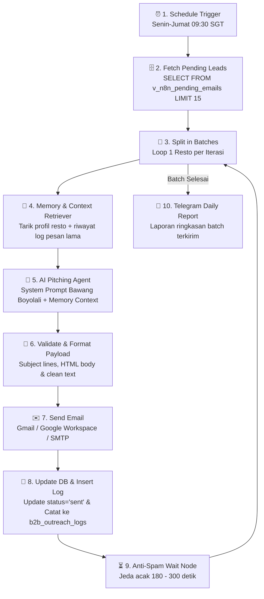

# 📋 PERENCANAAN WORKFLOW 2: Memory-Driven AI B2B Cold Outreach Engine
**Brand:** Juragan by Anak Bawang  
**Target:** Restoran Indonesia Terverifikasi yang Memiliki Email dari Hasil Scraping  
**Siklus Eksekusi:** Senin – Jumat Pukul `09:30 SGT` (Maksimal 15 Email/Hari)  

---

## 🎯 1. Tujuan & Arsitektur Memory-Driven Outreach

Workflow 2 adalah **Mesin Penjualan B2B Cerdas (Outreach Engine)**. Workflow ini bertindak independen setelah Workflow 1 memasukkan data ke Supabase:
1. Memfilter restoran yang **memiliki email** dan berstatus **`pending`**.
2. Menggunakan **Memory & Riwayat Interaksi** agar setiap email yang dihasilkan AI unik, kontekstual sesuai menu restoran, dan tidak pernah mengulang pesan yang sama.
3. Mengirimkan email secara bertahap dengan jeda acak anti-spam.
4. Mencatat histori percakapan ke database untuk membentuk "Memori Jangka Panjang" (*Long-Term Memory*).



---

## 🧠 2. Bagaimana Sistem Memori Bekerja (Memory Architecture)

Agar email tidak terdengar seperti bot atau template kaku, kita menerapkan 3 lapisan memori:

```text
┌─────────────────────────────────────────────────────────────────────────┐
│                          AI AGENT CONTEXT INJECTION                     │
├────────────────────────────────┬────────────────────────────────────────┤
│ 1. Entity Memory (Profil)      │ Nama: Tambuah Mas Orchard              │
│                                │ Rating: 4.1★ (1,102 Ulasan Google)     │
│                                │ Alamat: 290 Orchard Rd, #B1-44         │
│                                │ Kategori: Authentic Indonesian Cuisine │
├────────────────────────────────┼────────────────────────────────────────┤
│ 2. Interaction Memory (Log DB) │ Kontak Sebelumnya: Belum pernah        │
│                                │ Sudut Penawaran: Fresh Hook 1-to-1     │
│                                │ Status: Fresh Discovery Lead           │
├────────────────────────────────┼────────────────────────────────────────┤
│ 3. Core Value Prop (Brand)     │ Bawang Goreng Boyolali Asli (Cepogo)   │
│                                │ Grade S Murni (100% tanpa tepung)      │
│                                │ Grade A Crispy (~5% tepung garing)     │
│                                │ Halal Resmi (ID33110018517710724)      │
│                                │ Offer: 1kg Chef's Tasting Free Sample  │
└────────────────────────────────┴────────────────────────────────────────┘
```

---

## 📝 3. Master Pitching Prompt Specification

Prompt yang disuntikkan ke node AI (OpenAI / Claude / Gemini):

```markdown
# ROLE & GOAL
You are the B2B Outreach Director for "Juragan by Anak Bawang" (produced directly from Cepogo, Boyolali, Central Java). Write a high-converting, concise (100–140 words), warm, and peer-to-peer cold email to the restaurant manager/head chef in Singapore.

# PRODUCT LINEUPS & SELLING POINTS
1. Grade S Murni: 100% pure Boyolali shallots, 0% flour, authentic aromatic heritage oil release.
2. Grade A Crispy: Lightly dusted (~5% flour) for high-volume crunch retention.
3. Direct Factory Pricing: Cut out multi-layer distribution markups in Singapore.
4. Certifications: Halal Certified ID33110018517710724, standard export compliance.
5. Irresistible Hook: We want to deliver a complimentary 1kg chef's tasting sample box directly to their kitchen in Singapore.

# INPUT CONTEXT (FROM MEMORY)
- Restaurant: {{ $json.clean_name }}
- Location: {{ $json.address }}
- Reputation: {{ $json.rating }}★ from {{ $json.review_count }} Google diners
- Past Outreach History: {{ $json.past_logs || 'First time contact' }}

# OUTPUT FORMAT (STRICT JSON)
{
  "selected_subject": "[Personalized Subject Line]",
  "body_html": "<p>Hi [Name/Team],</p><p>...</p>",
  "body_text": "Plain text version..."
}
```

---

## 🧩 4. Rincian Node di Canvas n8n (Node-by-Node)

| No | Nama Node di n8n | Tipe Node | Fungsi & Konfigurasi |
|---|---|---|---|
| **1** | `1. Schedule (Mon-Fri 09:30 SGT)` | `scheduleTrigger` | Cron: `30 9 * * 1-5` |
| **2** | `2. Fetch Pending Leads` | `postgres` | `SELECT * FROM v_n8n_pending_emails LIMIT 15;` |
| **3** | `3. Loop Leads Sequentially` | `splitInBatches` | Memproses 1 lead per siklus loop |
| **4** | `4. AI Personalized Pitch Generator` | `openAi` / `langchain` | Menghasilkan subjek & body email sesuai profil unik restoran |
| **5** | `5. Format & Validate Payload` | `code` (JavaScript) | Memvalidasi JSON output AI dan menyusun signature email |
| **6** | `6. Send Email` | `gmail` / `smtp` | Mengirim email 1-to-1 via akun resmi |
| **7** | `7. Update b2b_leads Status` | `postgres` | Mengubah `status_email = 'sent'` & `email_sent_count = +1` |
| **8** | `8. Record to b2b_outreach_logs` | `postgres` | Mencatat isi pesan yang terkirim untuk memori jangka panjang |
| **9** | `9. Anti-Spam Wait Node` | `wait` | Jeda acak `180–300 detik` antar email |
| **10** | `10. Telegram Completion Alert` | `telegram` | Mengirim ringkasan batch harian ke HP Anda |

---

## 🛡️ 5. Proteksi Deliverability & Anti-Banned

1. **Jeda Acak (Random Jitter):**
   ```javascript
   Math.floor(Math.random() * (300 - 180 + 1)) + 180; // 3 - 5 Menit
   ```
2. **Quota Throttling:** Dibatasi maksimal 15 email/hari untuk menjaga *sender reputation* akun email Anda tetap 100% *Inbox*.
3. **Database Two-Way Sync:** Begitu email terkirim, status di Supabase langsung `sent` sehingga dashboard web di `B2BProspects.jsx` terupdate secara *realtime*.
