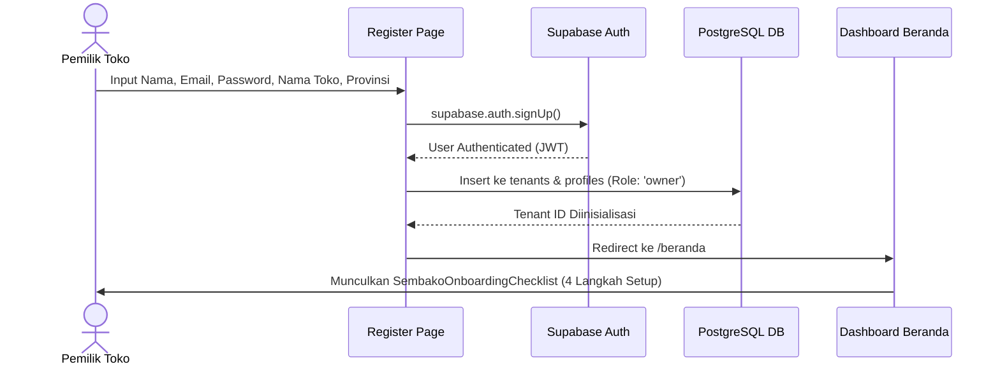
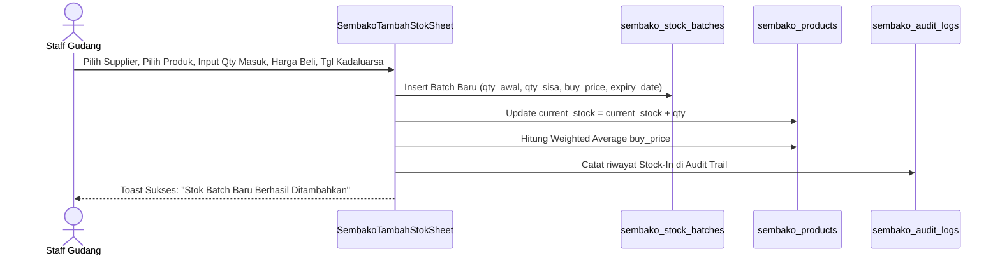
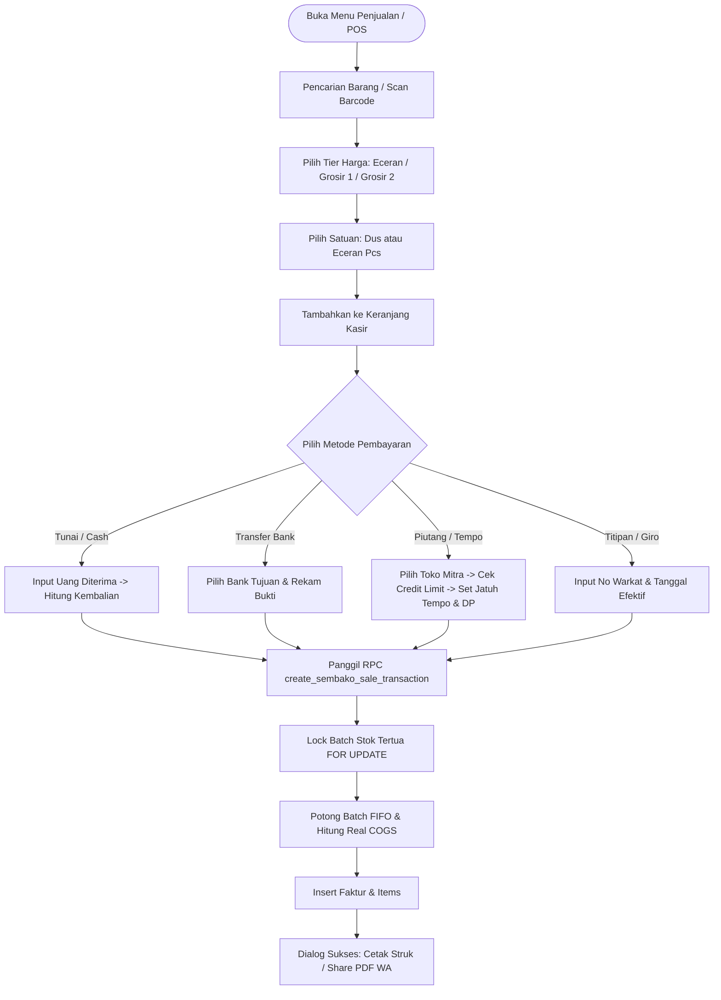
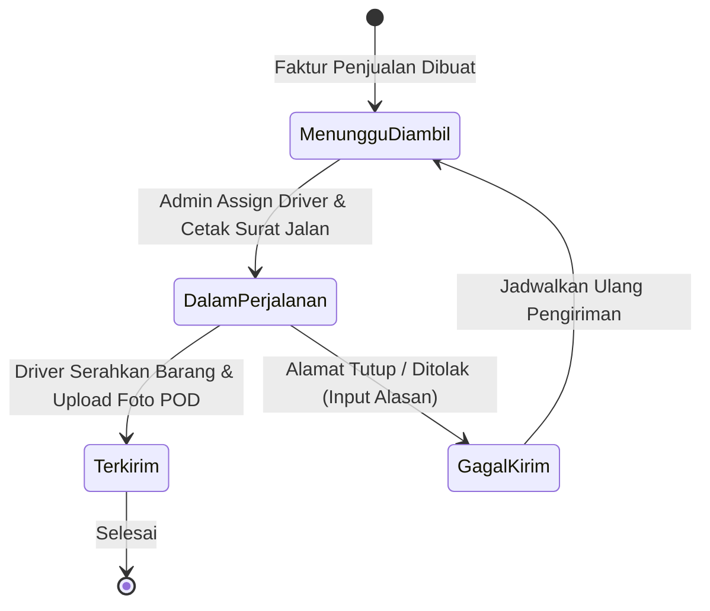
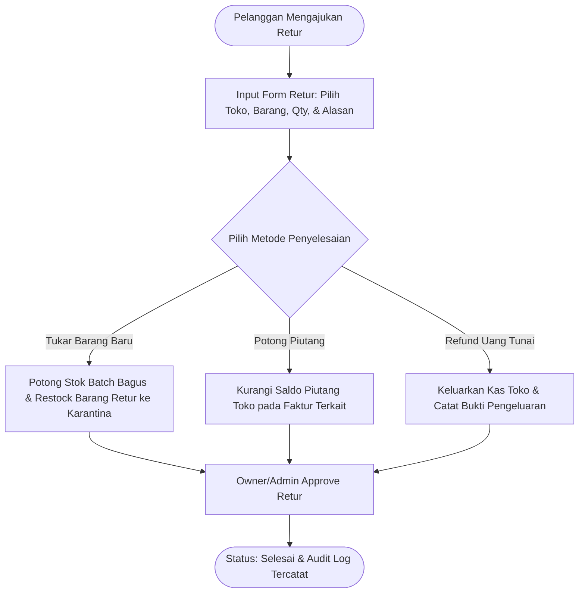
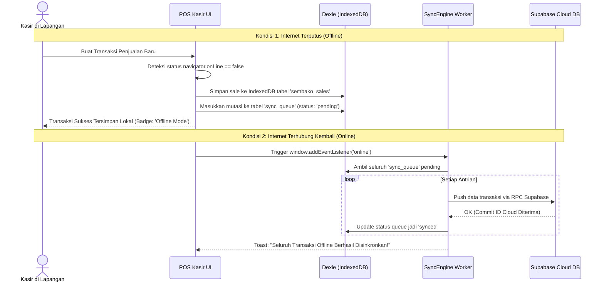

# 🔄 Panduan Alur Pengguna & Operasional Bisnis (User Flows)
## Virgin Master Dashboard — Core Financial, POS & Inventory OS

> Dokumen ini menyajikan seluruh alur perjalanan pengguna (*End-to-End User Journeys*) dan prosedur operasional standar (SOP) untuk pemilik toko (*Owner*), staf admin/kasir, petugas gudang, supir logistik, dan developer.

---

## 📑 Daftar Alur Kerja (User Journeys)

1. [Peta Alur Kerja Global (Global Operational Lifecycle)](#1-peta-alur-kerja-global-global-operational-lifecycle)
2. [Flow 1: Registrasi, Onboarding & Setup Profil Usaha Baru](#flow-1-registrasi-onboarding--setup-profil-usaha-baru)
3. [Flow 2: Input Master Produk, Satuan Dinamis & Multi-Tier Pricing](#flow-2-input-master-produk-satuan-dinamis--multi-tier-pricing)
4. [Flow 3: Pengadaan Barang & Penerimaan Stok Batch FIFO (Stock-In)](#flow-3-pengadaan-barang--penerimaan-stok-batch-fifo-stock-in)
5. [Flow 4: Transaksi Kasir POS, Barcode Scanning & Multi-Payment](#flow-4-transaksi-kasir-pos-barcode-scanning--multi-payment)
6. [Flow 5: Manajemen Piutang Toko Mitra, Limit Kredit & Penagihan WhatsApp](#flow-5-manajemen-piutang-toko-mitra-limit-kredit--penagihan-whatsapp)
7. [Flow 6: Logistik, Penugasan Armada Kurir & Proof of Delivery (POD)](#flow-6-logistik-penugasan-armada-kurir--proof-of-delivery-pod)
8. [Flow 7: Retur Barang Rusak / Kadaluarsa & Rekonsiliasi Saldo (Returns)](#flow-7-retur-barang-rusak--kadaluarsa--rekonsiliasi-saldo-returns)
9. [Flow 8: Stock Opname Fisik & Audit Penyesuaian Selisih Barang](#flow-8-stock-opname-fisik--audit-penyesuaian-selisih-barang)
10. [Flow 9: Penggajian Karyawan (Payroll) & Cetak Slip Gaji](#flow-9-penggajian-karyawan-payroll--cetak-slip-gaji)
11. [Flow 10: Analisis Laporan Finansial (P&L) & Tutup Buku Harian](#flow-10-analisis-laporan-finansial-pl--tutup-buku-harian)
12. [Flow 11: Mode Kasir Offline-First & Sinkronisasi Antrian Otomatis](#flow-11-mode-kasir-offline-first--sinkronisasi-antrian-otomatis)
13. [Flow 12: Interaksi Asisten AI (MAIA Router & Grok Reasoning)](#flow-12-interaksi-asisten-ai-maia-router--grok-reasoning)

---

## 1. Peta Alur Kerja Global (Global Operational Lifecycle)

```
 ┌─────────────────────────────────────────────────────────────────────────┐
 │                           SUPPLIER (PEMASOK)                            │
 └────────────────────────────────────┬────────────────────────────────────┘
                                      │ (Stok Masuk / Batch FIFO)
                                      ▼
 ┌─────────────────────────────────────────────────────────────────────────┐
 │                     GUDANG & INVENTARIS DISTRIBUTOR                     │
 │      • Penerimaan Batch Baru        • Pemantauan Expired Date           │
 │      • Stock Opname Fisik           • Log Audit Pergerakan Barang       │
 └────────────────────────────────────┬────────────────────────────────────┘
                                      │
                                      ▼
 ┌─────────────────────────────────────────────────────────────────────────┐
 │                       KASIR / POINT OF SALE (POS)                       │
 │      • Scan Barcode Produk          • Multi-Satuan (Sak/Dus/Pcs)        │
 │      • Tier Harga (Ecer/Grosir)     • Multi-Payment (Cash/Tempo/Bank)   │
 └───────────────────┬─────────────────────────────────┬───────────────────┘
                     │ (Kirim Barang)                  │ (Tempo / Piutang)
                     ▼                                 ▼
 ┌──────────────────────────────────────┐  ┌───────────────────────────────┐
 │           LOGISTIK & KURIR           │  │     BUKU BESAR PIUTANG TOKO   │
 │   • Penugasan Armada Driver          │  │   • Credit Limit Checking     │
 │   • Surat Jalan Pengiriman           │  │   • Reminder WA Jatuh Tempo   │
 │   • Proof of Delivery (Foto POD)     │  │   • Penerimaan Pembayaran DP  │
 └───────────────────┬──────────────────┘  └───────────────┬───────────────┘
                     │                                     │
                     └──────────────────┬──────────────────┘
                                        ▼
 ┌─────────────────────────────────────────────────────────────────────────┐
 │                     FINANCIAL & CLOSING INTELLIGENCE                    │
 │      • Rekap Laba/Rugi (P&L)        • Laporan Umur Piutang (AR Aging)   │
 │      • Payroll Staf & Komisi Supir  • Digest Tutup Toko Malam (20:00)   │
 └─────────────────────────────────────────────────────────────────────────┘
```

---

## Flow 1: Registrasi, Onboarding & Setup Profil Usaha Baru



1. **Pendaftaran Akun**: Calon pengguna mengisi form di `/register` (nama penanggung jawab, email, kata sandi, nama toko sembako, nomor HP, dan provinsi).
2. **Inisialisasi Multi-Tenant**: Database membuat record `tenants` baru dengan UUID unik dan `profiles` dengan role default `owner`.
3. **Onboarding Checklist (`SembakoOnboardingChecklist.jsx`)**:
   - Langkah 1: Lengkapi profil toko & nomor rekening pembayaran di `/akun`.
   - Langkah 2: Tambahkan 5 produk sembako pertama di `/produk`.
   - Langkah 3: Daftarkan 1 supplier dan 1 toko pelanggan mitra di `/toko-supplier`.
   - Langkah 4: Buat transaksi kasir uji coba pertama di `/penjualan`.

---

## Flow 2: Input Master Produk, Satuan Dinamis & Multi-Tier Pricing

```
Form Tambah Produk ➔ Input Identitas Barang ➔ Atur Konversi Satuan ➔ Tentukan 4 Tier Harga ➔ Simpan
```

1. **Buka Menu Produk**: Klik menu **Produk** ➔ tombol **+ Tambah Produk**.
2. **Pengisian Data Utama**:
   - Nama Produk (contoh: *Beras Rojolele Super 25kg*).
   - Barcode / SKU (bisa diketik manual atau di-scan via kamera).
   - Kategori (Beras, Minyak Goreng, Gula, Tepung, Mie & Pasta, Bumbu, Makanan & Camilan, Minuman).
3. **Satuan Utama & Konversi Satuan Dinamis**:
   - Satuan Basis Stok: `karton`, `dus`, `bal`, `pak`, `kg`, `liter`, atau `pcs`.
   - Satuan Turunan: Mengaktifkan opsi kemasan bertingkat (contoh: 1 Karton = 40 Pcs, 1 Dus = 20 Box, 1 Box = 10 Strip).
4. **Konfigurasi 4 Tingkat Harga (Multi-Tier Pricing)**:
   - **Harga Eceran**: Untuk pembeli umum / walk-in customer.
   - **Harga Grosir 1**: Untuk warung kelontong langganan menengah.
   - **Harga Grosir 2**: Untuk agen besar / sub-distributor partai besar.
   - **Harga Khusus**: Diskon kontrak per mitra dagang.
5. **Safety Stock Alert**: Mengisi batas minimal stok (`min_stock_alert`), misal 10 sak. Jika stok turun di bawah 10, sistem otomatis memberikan notifikasi peringatan.

---

## Flow 3: Pengadaan Barang & Penerimaan Stok Batch FIFO (Stock-In)



1. **Buka Menu Gudang / Produk**: Klik tombol **+ Tambah Stok (In)**.
2. **Pilih Pemasok**: Pilih supplier asal barang (contoh: *PT Indofood Makmur*).
3. **Detail Pembelian**:
   - Qty Masuk (misal: 100 Dus).
   - Harga Beli per Unit (HPP bersih sebelum ongkir/setelah diskon pabrik).
   - Biaya Pengiriman Tambahan (akan dialokasikan merata ke HPP unit).
   - Tanggal Pembelian & **Tanggal Kadaluarsa (Expiry Date)**.
4. **Eksekusi Batch**:
   - Sistem membuat entitas `sembako_stock_batches` baru dengan status aktif.
   - Mengkalkulasi ulang **Harga Beli Rata-Rata Terbobot (Weighted Average Cost)** pada master produk.
   - Mencatat log mutasi persediaan di `sembako_audit_logs`.

---

## Flow 4: Transaksi Kasir POS, Barcode Scanning & Multi-Payment



1. **Membuka Kasir**: Klik menu **Penjualan** ➔ **+ Buat Faktur Penjualan**.
2. **Scan / Pilih Produk**: Scan barcode barang menggunakan kamera smartphone atau cari nama produk via auto-suggest.
3. **Pilihan Satuan & Qty**: Memasukkan kuantitas dalam kemasan besar (Dus/Sak) atau eceran (Pcs).
4. **Penerapan Tier Harga & Diskon**: Sistem otomatis memilih tier harga default pelanggan atau kasir dapat memilih tier manual.
5. **Pemilihan Metode Bayar**:
   - **Cash (Lunas)**: Input nominal uang yang diserahkan pelanggan, sistem menghitung uang kembalian secara presisi.
   - **Transfer**: Memilih rekening bank tujuan penerimaan transfer.
   - **Piutang / Tempo**: Sistem memvalidasi apakah sisa plafon kredit toko pelanggan masih mencukupi. Jika melebihi limit, muncul peringatan konfirmasi otorisasi owner.
6. **Eksekusi Transaksi Atomik**: Backend mengeksekusi RPC `create_sembako_sale_transaction`:
   - Memotong batch stok tertua (*FIFO Logic*).
   - Menghitung HPP aktual dan laba kotor faktur secara instan.
7. **Pencetakan & Pembagian Faktur**:
   - Cetak nota kasir thermal 58mm/80mm Bluetooth.
   - Generate faktur resmi PDF ber-QR code.
   - Tombol kirim ke WhatsApp toko pelanggan dengan format pesan siap kirim.

---

## Flow 5: Manajemen Piutang Toko Mitra, Limit Kredit & Penagihan WhatsApp

```
Peringatan Jatuh Tempo (H-1/Hari H) ➔ Buka Detail Toko ➔ Cek Buku Besar Piutang ➔ Klik Tombol Tagih WA ➔ Terima Pembayaran Cicilan
```

1. **Deteksi Jatuh Tempo**: Cron otomatis Supabase (`pg_cron`) memindai faktur piutang yang jatuh tempo setiap hari jam 12:00 WIB dan mengirim notifikasi lonceng ke Admin/Owner.
2. **Buka Kartu Toko Mitra**: Klik menu **Toko & Supplier** ➔ pilih toko bersangkutan ➔ tab **Buku Besar Piutang**.
3. **Kirim Pengingat WhatsApp**:
   - Klik tombol **Tagih via WA**.
   - Sistem menyusun pesan formal ramah berisi: Nomor Faktur, Tanggal Belanja, Total Tagihan, Nominal Terbayar, Sisa Piutang, dan Rekening Transfer Toko.
4. **Pencatatan Pembayaran Cicilan (`SembakoPaymentSheet.jsx`)**:
   - Klik tombol **+ Catat Pembayaran**.
   - Masukkan nominal pembayaran cicilan (contoh: Toko membayar Rp 2.000.000 dari total tagihan Rp 5.000.000).
   - Pilih metode (Cash/Transfer).
   - Sistem memperbarui `paid_amount`, `remaining_amount`, dan jika sisa = 0, mengubah status menjadi `lunas`.

---

## Flow 6: Logistik, Penugasan Armada Kurir & Proof of Delivery (POD)



1. **Penugasan Pengiriman**: Admin membuka menu **Penjualan / Pengiriman** dan memilih faktur-faktur yang beralamat di satu rute pengiriman yang sama.
2. **Assign Armada**: Memilih Driver (misal: *Budi Santoso*) dan jenis kendaraan (*Pick-up GranMax AD-1234-XX*).
3. **Cetak Surat Jalan**: Mengunduh dan mencetak Delivery Order (DO) untuk supir.
4. **Status Dalam Perjalanan**: Supir berangkat mengantar barang, status berubah menjadi `departed` (`dalam_perjalanan`).
5. **Konfirmasi Serah Terima (POD Modal - `DeliveryCompletionModal.jsx`)**:
   - Driver tiba di toko tujuan.
   - Driver mengambil foto bukti serah terima barang atau meminta paraf penerima.
   - Input nama penerima (contoh: *Ibu Hj. Aminah - Pemilik Warung*).
   - Status pengiriman berubah menjadi `delivered` (`terkirim`) dan tercatat waktu `completed_at`.

---

## Flow 7: Retur Barang Rusak / Kadaluarsa & Rekonsiliasi Saldo (Returns)



1. **Pengajuan Retur**: Buka menu **Retur** ➔ klik **+ Buat Retur Baru**.
2. **Tipe Retur**:
   - **Retur Penjualan**: Barang dikembalikan oleh warung pelanggan (cacat kemasan, bocor, kadaluarsa).
   - **Retur Pembelian**: Distributor mengembalikan barang cacat ke pabrik supplier.
3. **Penyelesaian Retur**:
   - *Opsi 1 (Ganti Barang)*: Mengeluarkan stok pengganti yang bagus dari gudang.
   - *Opsi 2 (Potong Tagihan)*: Saldo piutang toko pada faktur otomatis terpotong senilai barang yang diretur.
   - *Opsi 3 (Cash Refund)*: Distributor mengembalikan uang tunai langsung ke pelanggan.
4. **Verifikasi Gudang & Persetujuan**: Petugas gudang memvalidasi fisik barang ➔ Admin menyetujui (`disetujui`) ➔ Status selesai.

---

## Flow 8: Stock Opname Fisik & Audit Penyesuaian Selisih Barang

1. **Persiapan Audit**: Petugas gudang mencetak lembar kerja hitung fisik stok dari menu **Produk / Gudang**.
2. **Pemeriksaan Fisik**: Menghitung jumlah fisik aktual di rak gudang (misal: Sistem mencatat *Minyak Fortune 2L = 120 Pcs*, fisik ditemukan *118 Pcs*).
3. **Input Penyesuaian (`useAdjustStockOpname`)**:
   - Buka produk terkait ➔ Klik **Stock Opname**.
   - Masukkan Qty Fisik Aktual.
   - Pilih Alasan Selisih: *Bocor / Pecah*, *Kadaluarsa / Rusak*, *Hilang / Selisih Hitung*, atau *Koreksi Awal*.
   - Masukkan Catatan Berita Acara.
4. **Rekonsiliasi Otomatis**:
   - Sistem secara otomatis menyesuaikan `current_stock` pada tabel produk.
   - Membuat record pengurang di `sembako_stock_out` dengan reason `opname_loss`.
   - Mencatat nilai kerugian barang hilang ke laporan laba rugi.

---

## Flow 9: Penggajian Karyawan (Payroll) & Cetak Slip Gaji

1. **Buka Menu Pegawai**: Masuk ke menu **Pegawai** ➔ tab **Penggajian / Payroll**.
2. **Pilih Periode Gaji**: Pilih periode penggajian (Mingguan atau Bulanan).
3. **Komponen Penggajian**:
   - Gaji Pokok (sesuai kontrak kerja karyawan).
   - Uang Makan & Tunjangan Harian (dikalikan jumlah hari hadir).
   - Komisi Rit Pengiriman Driver (otomatis teragregasi dari jumlah DO sukses yang diselesaikan supir).
   - Bonus Kinerja Kasir / Penjualan.
   - Potongan Kasbon / Pinjaman Staf.
4. **Verifikasi & Pembayaran**:
   - Owner mereview total nominal gaji bersih (`total_pay`).
   - Klik **Tandai Telah Dibayar (Paid)**.
   - Cetak Slip Gaji resmi dalam format PDF / thermal untuk diserahkan ke karyawan.

---

## Flow 10: Analisis Laporan Finansial (P&L) & Tutup Buku Harian

```
Filter Rentang Tanggal ➔ Review Gross Profit & Net Profit ➔ Analisis Aging Piutang ➔ Ekspor PDF Resmi ➔ Terima Digest Tutup Toko (20:00 WIB)
```

1. **Buka Menu Laporan**: Masuk ke menu **Laporan**.
2. **Filter Periode**: Pilih filter waktu (Hari Ini, 7 Hari Terakhir, Bulan Ini, Kuartal, atau Custom Date Range).
3. **Komponen Laba Rugi Komprehensif (P&L)**:
   - Total Omzet Penjualan Bersih.
   - Harga Pokok Penjualan (HPP / COGS berbasis batch aktual yang terjual).
   - **Laba Kotor (Gross Profit)** = Omzet - HPP.
   - Beban Operasional: Gaji Staf, Bensin Armada, Listrik, Sewa Gudang, Penyusutan Kerusakan Barang.
   - **Laba Bersih Operasional (Net Profit)** = Laba Kotor - Total Biaya Operasional.
4. **Analisis Umur Piutang (AR Aging Schedule)**:
   - Meninjau sebaran tagihan piutang toko: Belum Jatuh Tempo, 1-15 Hari, 16-30 Hari, 31-60 Hari, dan >60 Hari (berpotensi kredit macet).
5. **Ekspor Laporan Resmi (`FinancialReportPdfModal.jsx`)**: Mengunduh berkas PDF laporan keuangan siap cetak untuk arsip pembukuan atau pelaporan pajak.
6. **Laporan Tutup Toko Otomatis**: Setiap pukul 20:00 WIB, cron server mengirim ringkasan performa penjualan hari itu ke perangkat Owner.

---

## Flow 11: Mode Kasir Offline-First & Sinkronisasi Antrian Otomatis



1. **Transaksi Tanpa Internet**: Kasir tetap dapat membuka katalog produk, mencari barang, menghitung total belanja, dan mencetak struk thermal ke printer Bluetooth meskipun koneksi internet terputus total.
2. **Penyimpanan Lokal**: Data transaksi disimpan ke **IndexedDB browser (Dexie.js)** dan dicatat dalam antrian `sync_queue`.
3. **Deteksi Otomatis Koneksi**: Begitu perangkat kembali mendapatkan sinyal WiFi / 4G, `SyncEngine` secara otomatis mengeksekusi antrian secara berurutan (*FIFO Queue*).
4. **Rekonsiliasi Data**: Stok di cloud server diperbarui dan ID cloud diselaraskan ke database lokal tanpa duplikasi data.

---

## Flow 12: Interaksi Asisten AI (MAIA Router & Grok Reasoning)

1. **Membuka Asisten AI**: Menekan floating action button ikon robot di pojok kanan bawah aplikasi.
2. **Context Injection**: Sistem secara otomatis menyisipkan ringkasan data usaha tenant saat itu (sisa stok tipis, total piutang overdue, omzet hari ini) ke dalam system prompt AI.
3. **Contoh Pertanyaan Operasional**:
   - *"Sebutkan 3 toko yang piutangnya paling besar dan sudah melewati tanggal jatuh tempo!"*
   - *"Berapa estimasi laba bersih toko saya dalam 7 hari terakhir?"*
   - *"Produk apa yang harus saya order ulang ke supplier minggu ini?"*
4. **Eksekusi Aksi Cepat (*Action Inserter*)**: Pengguna dapat memerintahkan AI untuk membuat draf transaksi secara otomatis melalui percakapan alami.
