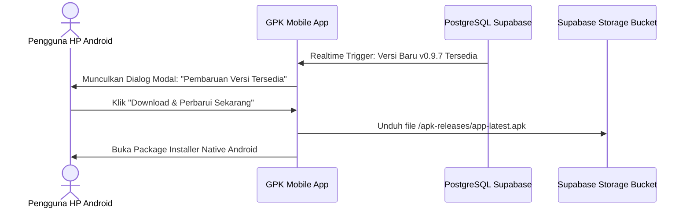

# 📱 Offline-First, Android Capacitor, CI/CD & DevOps
## Virgin Master Dashboard — Core Financial, POS & Inventory OS

> Dokumen ini menyajikan panduan arsitektur Offline-First, konfigurasi build native Android (Capacitor 8), pipeline automasi CI/CD GitHub Actions, mekanisme in-app auto-update, serta ketentuan lisensi komersial dan kontrak kerja sama.

---

## 📑 Daftar Isi
1. [Arsitektur Offline-First & Dexie.js (IndexedDB)](#1-arsitektur-offline-first--dexiejs-indexeddb)
2. [SyncEngine: Alur Sinkronisasi & Penyelesaian Konflik](#2-syncengine-alur-sinkronisasi--penyelesaian-konflik)
3. [Build Aplikasi Mobile Android (Capacitor 8)](#3-build-aplikasi-mobile-android-capacitor-8)
4. [CI/CD Pipeline GitHub Actions (`build-apk.yml`)](#4-cicd-pipeline-github-actions-build-apkyml)
5. [Manajemen Versi Terpadu (One-Command Bump)](#5-manajemen-versi-terpadu-one-command-bump)
6. [In-App Auto-Update & Distribusi APK via Supabase Storage](#6-in-app-auto-update--distribusi-apk-via-supabase-storage)
7. [Kontrak Kerja Sama & Skema Lisensi SaaS](#7-kontrak-kerja-sama--skema-lisensi-saas)

---

## 1. Arsitektur Offline-First & Dexie.js (IndexedDB)

Untuk mengantisipasi koneksi internet yang tidak stabil di area gudang atau rute distribusi pelosok, aplikasi Virgin Dashboard menerapkan pendekatan **Offline-First** berbasis **Dexie.js**:

```
 ┌────────────────────────────────────────────────────────┐
 │                      REACT 19 UI                       │
 │  (Point of Sale • Scan Barcode • Katalog Barang)       │
 └───────────────────────────┬────────────────────────────┘
                             │
            ┌────────────────┴────────────────┐
            │                                 │
    (Saat Offline)                     (Saat Online)
            ▼                                 ▼
 ┌──────────────────────┐             ┌───────────────────┐
 │   LOCAL INDEXEDDB    │             │   SUPABASE CLOUD  │
 │  • sembako_products  │             │   POSTGRESQL DB   │
 │  • sembako_customers │             │  • RLS Protected  │
 │  • sync_queue (FIFO) │             │  • Atomic RPC     │
 └──────────┬───────────┘             └─────────▲─────────┘
            │                                   │
            └───────────► SyncEngine ───────────┘
                    (Auto-Flush saat Online)
```

### Skema Database Lokal (`src/lib/offline/db.js`):
- **`products`**: Salinan katalog produk lokal untuk pencarian instan tanpa delay jaringan.
- **`customers`**: Data toko mitra dan status limit piutang.
- **`sales`**: Faktur penjualan yang dibuat secara offline.
- **`sync_queue`**: Antrian mutasi tertunda dengan metadata: `id`, `table_name`, `action` (`INSERT`/`UPDATE`), `payload`, `status` (`pending`/`synced`/`failed`), dan `created_at`.

---

## 2. SyncEngine: Alur Sinkronisasi & Penyelesaian Konflik

Berkas `src/lib/offline/syncEngine.js` mengorkestrasi siklus hidup data:

1. **Pull Awal (`pullInitialData`)**: Mengunduh snapshot data produk, pelanggan, dan supplier dari Supabase ke IndexedDB saat aplikasi pertama kali terhubung ke internet.
2. **Penyimpanan Lokal & Optimistic UI**: Saat kasir membuat penjualan dalam kondisi offline:
   - Data langsung tersimpan di IndexedDB.
   - Antrian mutasi dicatat ke `sync_queue` dengan status `pending`.
   - UI memberikan konfirmasi sukses instan dengan badge *"Tersimpan Offline"*.
3. **Auto-Flush saat Koneksi Pulih (`window.addEventListener('online')`)**:
   - `SyncEngine` membaca antrian `sync_queue` secara berurutan (*FIFO order*).
   - Menembakkan payload transaksi ke RPC Supabase `create_sembako_sale_transaction`.
   - Setelah server mengembalikan respons sukses, status antrian diubah menjadi `synced`.
   - Menampilkan notifikasi toast: *"Semua transaksi offline berhasil disinkronkan ke server cloud!"*.

---

## 3. Build Aplikasi Mobile Android (Capacitor 8)

Aplikasi dibungkus menjadi file native Android APK menggunakan **Capacitor 8**:

### Konfigurasi `capacitor.config.json`:
```json
{
  "appId": "com.virgin.erp",
  "appName": "VirginERP",
  "webDir": "dist",
  "bundledWebRuntime": false,
  "server": {
    "androidScheme": "https"
  },
  "plugins": {
    "PushNotifications": {
      "presentationOptions": ["badge", "sound", "alert"]
    }
  }
}
```

### Optimasi Native Android:
- **Target SDK 35 & Compile SDK 36**: Kompatibilitas penuh dengan Android 14 dan Android 15.
- **Hardware Acceleration & Memory**: Konfigurasi `android:largeHeap="true"` pada `AndroidManifest.xml` untuk mencegah *Out-of-Memory (OOM)* pada perangkat berkapasitas RAM terbatas (Samsung / Xiaomi budget class).
- **Penanganan Tombol Back Fisik (`useCapacitorBackNavigation.js`)**: Menutup sheet/modal terbuka terlebih dahulu sebelum keluar aplikasi, mencegah *accidental exit*.

### Panduan Build Manual Lokal:
```bash
# 1. Kompilasi bundle web produksi
npm run build

# 2. Sinkronkan asset ke folder android
npx cap sync android

# 3. Buka project di Android Studio
npx cap open android

# 4. Build APK rilis langsung via command line (Windows)
cd android && .\gradlew.bat assembleRelease && cd ..
```

---

## 4. CI/CD Pipeline GitHub Actions (`build-apk.yml`)

Setiap kali branch `main` menerima commit/push, GitHub Actions menjalankan workflow build otomatis di cloud runner Ubuntu:

```mermaid
flowchart LR
    Push([Push ke main]) --> Checkout[Checkout Repo & Setup Node 22 + Java 21]
    Checkout --> BuildWeb[npm run build Web Bundle]
    BuildWeb --> CapSync[npx cap sync android]
    CapSync --> GradleBuild[Gradle Assemble Debug APK]
    GradleBuild --> ExtractMeta[Ekstrak Version & Build Date]
    ExtractMeta --> UploadArtifact[Upload GitHub Actions ZIP Artifact]
    UploadArtifact --> DeploySupabase[Upload APK ke Supabase Storage & Track Release]
```



### Fitur Utama Pipeline:
1. **Dynamic Artifact Naming**: ZIP artifact di tab Actions otomatis diberi nama sesuai versi dan tanggal:
   ```
   📦 GPK-APK-v0.9.7-b20260820.zip
   ```
2. **Cloud Storage Deployment**: File APK diunggah otomatis ke Supabase Storage bucket **`apk-releases`**:
   - `app-latest.apk` (pointer rilis terbaru untuk download instan).
   - `app-v0.9.7.apk` (arsip rilis permanen per versi).
3. **Database Release Tracking**: Mencatat record baru ke tabel `public.app_releases`.

---

## 5. Manajemen Versi Terpadu (One-Command Bump)

Proyek ini dilengkapi skrip automasi versi untuk menyinkronkan seluruh titik metadata dalam **1 perintah tunggal**:

```bash
# Naikkan versi patch (contoh: v0.9.6 ➔ v0.9.7) & set build number ke tanggal hari ini
npm run bump

# Naikkan versi minor (contoh: v0.9.7 ➔ v0.10.0)
npm run bump minor

# Naikkan versi major (contoh: v0.10.0 ➔ v1.0.0)
npm run bump major

# Tentukan versi dan build number manual
npm run bump v1.0.1 20260822
```

### Berkas yang Disinkronkan Otomatis:
1. `src/dashboard/_shared/pages/akun_page/constants.js` (`APP_VERSION`, `APP_BUILD_NUMBER`, `APP_VERSION_LABEL`)
2. `package.json` (`version`)
3. `android/app/build.gradle` (`versionCode`, `versionName`)
4. `README.md` (Badge Version)

---

## 6. In-App Auto-Update & Distribusi APK via Supabase Storage



- Hook `useAppUpdate.js` secara otomatis membandingkan versi aplikasi lokal dengan versi rilis aktif di tabel `app_releases`.
- Jika versi cloud lebih tinggi, pengguna mendapatkan dialog pembaruan dengan tombol unduh langsung yang mengarah ke link CDN Supabase Storage.

---

## 7. Kontrak Kerja Sama & Skema Lisensi SaaS

Pengelolaan operasional platform dan hubungan komersial diatur secara formal dalam dokumen hukum **`docs/templates/KONTRAK_LAYANAN_TEMPLATE.md`** (template surat perjanjian kerja sama) serta generator PDF otomatis **`scripts/generate_contract_pdf.jsx`**.

### Parameter Konfigurasi Kontrak (Environment-Aware):
- **Pihak Pertama (Pengembang / Penyedia Jasa)**: `DEV_NAME`, `DEV_BRAND`, `DEV_PHONE`
- **Pihak Kedua (Klien / Pengguna Layanan)**: `CLIENT_NAME`, `CLIENT_BIZ_NAME`, `CLIENT_ADDRESS`
- **Biaya Setup & Konfigurasi Awal (One-Time)**: `SETUP_FEE` (Default: *Rp 1.500.000,-*)
- **Biaya Langganan Server & Cloud DB (Bulanan)**: `MONTHLY_FEE` (Default: *Rp 500.000,- / bulan*)
- **Biaya Permintaan Fitur Minor (Change Request)**: `MINOR_FEE` (Default: *Rp 150.000,- s.d. Rp 200.000,- / fitur*)
- **Service Level Agreement (SLA)**: Penanganan insiden kritis (server down) maksimal 1–3 jam.
- **Grace Period & Suspend**: Masa toleransi keterlambatan pembayaran 7 hari kalender. Jika melewati masa toleransi, akses aplikasi otomatis terkunci via `LockedServerPage.jsx`.
- **Rekening Resmi Pembayaran**: `BANK_NAME`, `BANK_ACC_NO`, `BANK_ACC_NAME`

### Cara Membuat Berkas PDF Kontrak Resmi:
```bash
npm run contract:pdf
```
Perintah di atas akan mengeksekusi `scripts/generate_contract_pdf.jsx` dan menghasilkan berkas `docs/templates/KONTRAK_LAYANAN_TEMPLATE.pdf` siap tanda tangan bermeterai.

